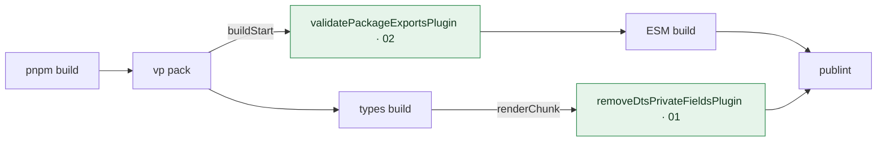

<!-- pr-guide -->
## PR guide

Hono's build used to run two standalone Node scripts around `vp pack`: one validated `package.json` against `jsr.json` exports, and another stripped `#private` fields from the emitted `.d.ts` files. This PR moves both jobs into `vp pack` plugins in `vite.config.ts`, so they run inside the bundler. It also swaps the `oxc-parser` dependency for `rolldown`, which already powers the build.

1. `pnpm build` now runs `vp pack` directly, with no pre- or post-build scripts.
2. In the ESM build, the `buildStart` hook of `validatePackageExportsPlugin` checks that `package.json` and `jsr.json` export the same entries.
3. In the types build, the `renderChunk` hook of `removeDtsPrivateFieldsPlugin` parses each `.d.ts` chunk with `rolldown/utils` and removes `#private` class fields.
4. The old `build/*.ts` scripts and their tests are deleted, and `oxc-parser` is replaced by `rolldown`.

**What runs during pnpm build** (green = added in this PR, number = chapter)

### Chapters

| | Chapter | Files | Lines |
|---|---|---|---|
| 01 | Strip private fields in a plugin | 3 | +79 −83 |
| 02 | Validate exports at build start | 3 | +1 −68 |
| 03 | Drop the old build scripts | 3 | +2 −19 |
| 04 | Generated files | 1 | +171 −188 |

<b>01 · Strip private fields in a plugin</b> &nbsp;(+79 −83)

`removeDtsPrivateFieldsPlugin` replaces `build/remove-private-fields.ts`. It runs in `renderChunk` for `.d.ts` output only, parses the chunk with `parse` from `rolldown/utils`, and removes each `PropertyDefinition` whose key is a `PrivateIdentifier`. The plugin is attached only to the `dist/types` config, where `emitDtsOnly` is set.

One behaviour change: the old script replaced `#private;` with spaces so offsets stayed stable, but `ms.remove()` deletes the text. That's fine for declaration files unless something relies on the old offsets, such as sourcemaps for the `.d.ts` files. The unit test for this logic is deleted, not moved, so check whether that coverage is still wanted.

- [`vite.config.ts`](https://github.com/honojs/hono/pull/5448/files#diff-6a3b01ba97829c9566ef2d8dc466ffcffb4bdac08706d3d6319e42e0aa6890ddR1) +79 −0
- [`build/remove-private-fields.ts`](https://github.com/honojs/hono/pull/5448/files#diff-663030e795986d61c9eb77bdc9a67a729e5d473d4f4be367cae6fc178f07050e) +0 −57
- [`build/remove-private-fields.test.ts`](https://github.com/honojs/hono/pull/5448/files#diff-062673f93027d0e57b4562a775284de280712ad31ac7868728d029a59a5cf7b3) +0 −26

<b>02 · Validate exports at build start</b> &nbsp;(+1 −68)

`validatePackageExportsPlugin` inlines the old `validateExports` helper almost verbatim and runs it in `buildStart`, comparing `package.json` and `jsr.json` exports in both directions. It is registered only on the ESM config; the comment on the CJS config explains why it is skipped there.

Check the JSON imports: `await import('./package.json', { with: { type: 'json' } })` returns a module namespace, so `pkgJson.exports` relies on the bundler exposing named keys from JSON. The original read `.exports` from a parsed object, and `pkgJson.default.exports` would be the safe form. Like chapter 1, the old unit test (`validate-exports.test.ts`) is deleted without a replacement.

- [`vite.config.ts`](https://github.com/honojs/hono/pull/5448/files#diff-6a3b01ba97829c9566ef2d8dc466ffcffb4bdac08706d3d6319e42e0aa6890ddR1) +1 −0
- [`build/validate-exports.ts`](https://github.com/honojs/hono/pull/5448/files#diff-26b14a474b3714abe10d5df790c089c4d080ddfd9f3e72660d9c6d834d361dc6) +0 −37
- [`build/validate-exports.test.ts`](https://github.com/honojs/hono/pull/5448/files#diff-a2edc778c6a1f420fc65e98ef1b39c733842f633463cc4604c89769045775856) +0 −31

<b>03 · Drop the old build scripts</b> &nbsp;(+2 −19)

The `build` script loses the `validate-package-exports.ts` and `strip-private-fields.ts` steps around `vp pack`, and both entry scripts are deleted. `oxc-parser` is replaced with `rolldown` in `devDependencies`; the lockfile changes are in the last chapter.

- [`package.json`](https://github.com/honojs/hono/pull/5448/files#diff-7ae45ad102eab3b6d7e7896acd08c427a9b25b346470d7bc6507b6481575d519R32) +2 −2
- [`build/validate-package-exports.ts`](https://github.com/honojs/hono/pull/5448/files#diff-6c52178e26a7cea638999fbb33b221b126789d65d08d9194881bc9e7d2d811fb) +0 −9
- [`build/strip-private-fields.ts`](https://github.com/honojs/hono/pull/5448/files#diff-487db84ea723c3b5bbb599fd00c290742c14ec8d2ef791b968f92414db798e45) +0 −8

<b>04 · Generated files</b> &nbsp;(+171 −188)

Lockfiles, snapshots and other generated output. Usually safe to skim.

- [`pnpm-lock.yaml`](https://github.com/honojs/hono/pull/5448/files#diff-32824c984905bb02bc7ffcef96a77addd1f1602cff71a11fbbfdd7f53ee026bbR211) +171 −188

The guide explains intent and points at what to check. It is not a review: code it doesn't mention isn't verified.

Covers all 9 changed files at `fcd351b`.